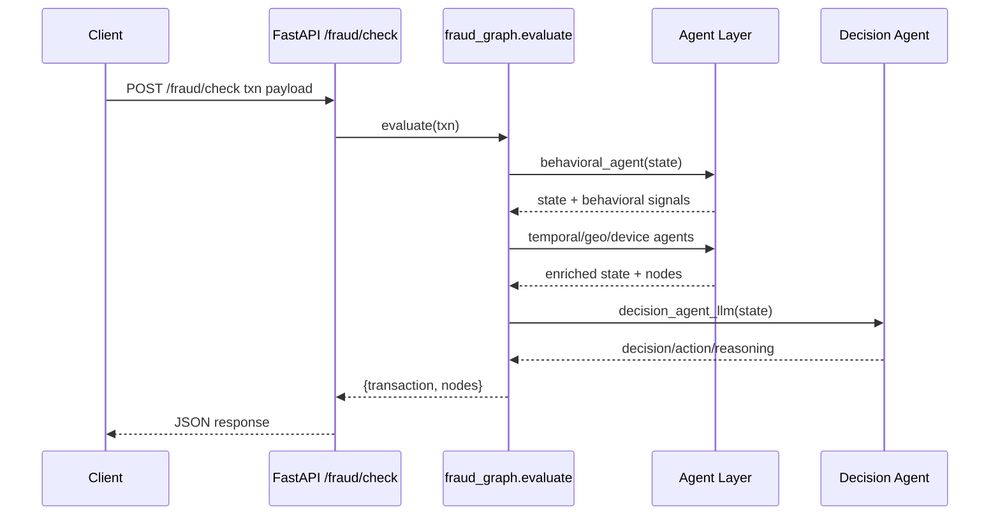
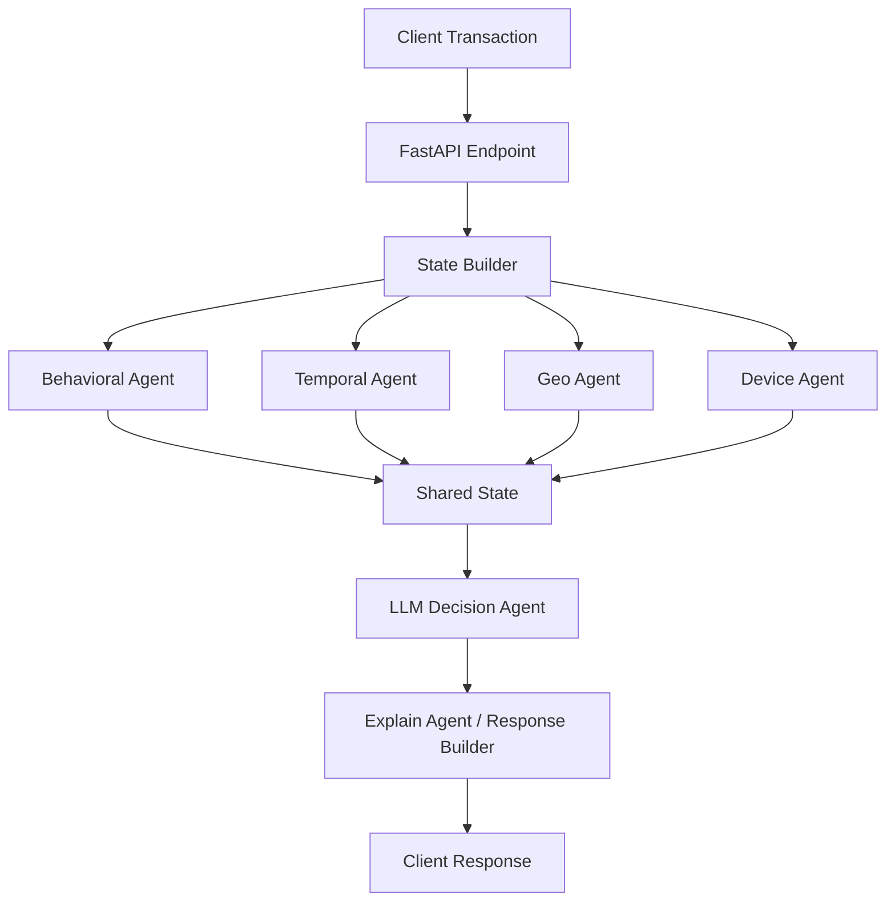

# FinShield Agentic Fraud Detection – Product Requirements Document

## 1. Problem Statement
Financial institutions must detect fraudulent transactions quickly while minimizing false positives that frustrate legitimate customers. Even a few seconds of delay can lead to chargebacks or customer churn. FinShield orchestrates multiple specialized AI agents (behavioral, temporal, geo, device, and an LLM decision/explain agent) in a LangGraph-powered workflow to provide explainable, real-time risk assessments for every transaction.

## 2. Vision & Objectives
1. **Holistic risk view** – blend behavioral, temporal, geographic, and device signals instead of relying on single-point heuristics.
2. **Explainable automation** – every automated decision should cite the contributing signals so analysts and regulators can audit the pipeline.
3. **Composable agents** – each agent is an isolated micro-service function that can be swapped or improved without rewriting the full graph.
4. **Production-ready workflow** – LangGraph (LangChain) gives us concurrency controls, retries, and observability hooks.

### Success Metrics
- Reduce manual reviews by ≥25% through higher-confidence automated ALLOW/BLOCK decisions.
- Detect anomalous transactions within <2 seconds per evaluation (p95 end-to-end latency).
- Provide auditable explanations for 100% of scored transactions.
- Maintain initial precision ≥0.85 and recall ≥0.75 on validation data.

## 3. Personas & User Stories
- **Fraud Operations Analyst**
  - Needs a UI/JSON response with transaction summary, risk score by agent, and final decision.
  - User story: “As an analyst, I want to see which agent raised the risk so I can decide whether to escalate or override.”
- **Risk Platform Engineer**
  - Responsible for integrating FastAPI endpoint with upstream payment switches.
  - User story: “As an engineer, I need a stable API contract and state schema to deploy FinShield inside our fraud stack.”
- **Compliance/Audit Stakeholder**
  - Reviews historical decision traces for regulators.
  - User story: “As an auditor, I need to pull an explanation trace showing all signals considered for a suspicious transaction.”

## 4. System Overview

### 4.1 Logical Architecture
1. **Inbound API (`app.py`)** – FastAPI endpoint `/fraud/check` receives transaction JSON.
2. **State Initialization (`fraud_graph.evaluate`)**
   - Loads customer history from `transactions.csv` (prototype) or future feature store.
   - Seeds `state = {"txn": <transaction>, "customer_txns": <DataFrame>, "nodes": []}`.
3. **Agent Layer (LangGraph nodes)**
   - Behavioral, Temporal, Geo, Device agents mutate shared state with scores and reasons.
   - Agents are designed to run in parallel; current implementation is sequential for clarity.
4. **Decision Layer (`decision_agent_llm`)**
   - Consumes aggregated risks and reasons; uses Ollama `mistral` to output `decision`, `action`, `reasoning`.
5. **Explainability Layer (`explain_agent`)**
   - Packages the decision, action, and contributing signals into `state["explanation"]`.
6. **Response Serializer**
   - Returns original txn + ordered `nodes` list to API caller.

### 4.2 Sequence Diagram


### 4.3 Data Flow Diagram


## 5. API Contract & Sample

### 5.1 Request (`POST /fraud/check`)
```json
{
  "transactionId": "txn-001",
  "customerId": "123",
  "amount": 1200.0,
  "merchant": "Amazon",
  "location": "Nigeria",
  "deviceId": "device-001",
  "timestamp": "2026-01-07T12:00:00Z",
  "channel": "web",
  "paymentMethod": "credit_card"
}
```

### 5.2 Response
```json
{
  "transaction": { ... original payload ... },
  "nodes": [
    {
      "id": "behavioral_agent",
      "name": "Behavioral Agent",
      "risk": 0.42,
      "reason": "Amount 3x higher than historical average"
    },
    {
      "id": "temporal_agent",
      "name": "Temporal Agent",
      "risk": 0.60,
      "reason": "Transaction at 02:15 where customer rarely transacts"
    },
    {
      "id": "geo_agent",
      "name": "Geo Agent",
      "risk": 0.10,
      "reason": "Location consistent with prior behavior"
    },
    {
      "id": "device_agent",
      "name": "Device Agent",
      "risk": 0.20,
      "reason": "New device fingerprint"
    },
    {
      "id": "llm_agent",
      "name": "LLM Decision Agent",
      "decision": "MID_RISK",
      "action": "REVIEW",
      "reasoning": "Late-night high-amount transaction on new device"
    }
  ]
}
```

## 6. Detailed Agent Specifications

### 6.1 Shared Implementation Standards
- Every agent function accepts and returns the shared `state` dict.
- Each agent must:
  1. Call `state.setdefault("nodes", [])` before appending.
  2. Avoid mutating `txn` or `customer_txns` keys (treat them as read-only inputs).
  3. Write `state["<agent>_risk"]` (0–1 float) and `state["<agent>_reason"]` (string).
  4. Push a node entry `{id, name, risk, reason}` for visualization.
- Agents should remain deterministic given the same state except where LLM randomness is desired.

### 6.2 Behavioral Agent (`agents/behavioral_agent.py`)
- **Purpose**: Identify spending anomalies by comparing current amount/merchant with historical stats.
- **Inputs**: `state["txn"]`, `state["customer_txns"]` (DataFrame) or `transaction_history` (list).
- **Processing Steps**:
  - Build summary string containing total transactions, average amount, min/max.
  - Prompt OpenAI `gpt-4o-mini` via structured output (`BehaviouralSchema`) requesting risk/label/reason.
  - Persist results back into state and nodes.
- **Outputs**:
  - `behavioral_risk`, `behavioral_label`, `behavioral_reason`.
  - Node entry with agent id/name/risk/reason.
  - Future enhancement: include merchant-specific statistics, rolling averages, and spending velocity.

### 6.3 Temporal Agent (`agents/temporal_agent.py`)
- **Purpose**: Detect unusual transaction times (late-night spikes, off-hours behavior).
- **Inputs**: `state["txn"]`, `state["customer_txns"]`.
- **Processing**:
  - Parse timestamp as pandas datetime; derive hour-of-day.
  - Assign base risk by hour bucket (late-night highest, business hours lowest).
  - Compare against customer modal hour(s) and average hour to determine deviation adjustments.
  - Compute frequency of historical transactions occurring at the same hour to catch “never seen before” events.
- **Outputs**:
  - `temporal_risk` (capped at 0.95), `temporal_reason`.
  - Node entry.
  - Edge cases: missing timestamp leads to default moderate risk `0.3` with reason “No timestamp provided”.

### 6.4 Geo Agent (`agents/geo_agent.py`)
- **Purpose**: Flag geographically abnormal transactions (different country/region/IP).
- **Current Logic**: Placeholder returns `0.1` risk if location matches typical behavior.
- **Roadmap**:
  - Integrate `tools/geo_tool.py` for geodistance calculations between historical lat/long and current transaction.
  - Include high-risk geography list, impossible travel velocity detection, and IP-to-location correlation.

### 6.5 Device Agent (`agents/device_agent.py`)
- **Purpose**: Assess whether the device fingerprint aligns with known customer devices.
- **Current Logic**: Example stub returning `0.1` (“known device”).
- **Enhancements**:
  - Use `device_tool.device_risk_score` to score device_id, browser fingerprint, OS version, jailbreak/root signals.
  - Maintain persistent device reputation store keyed by customerId/deviceId pair.

### 6.6 Decision Agent (`agents/decision_agent_llm.py`)
- **Purpose**: Combine signals and recommend `decision` + `action`.
- **Inputs**: All risk/ reason keys plus optional `state["trace"]`.
- **Processing**:
  - Build textual prompt describing each agent’s risk/ reason.
  - Invoke Ollama `mistral` (temperature 0) expecting JSON with schema `{decision, action, reasoning}`.
  - Regex-parse JSON to guard against additional text; fallback to deterministic rule if parsing fails.
  - Append LLM trace entries for observability.
- **Outputs**:
  - `decision`, `action`, `llm_reasoning`.
  - Node appended in `fraud_graph.evaluate`.

### 6.7 Explain Agent (`agents/explain_agent.py`)
- **Purpose**: Compose final explanation object with decision, action, LLM reasoning, and contributing signals for UI/analyst consumption.
- **Usage**: Hook after decision agent (currently basic, but extensible to add ordered signal breakdowns).

## 7. Data & State Contract

| Key | Type | Description |
| --- | --- | --- |
| `txn` | dict | Canonical incoming transaction (customerId, amount, merchant, location, deviceId, timestamp, etc.). |
| `customer_txns` | pandas.DataFrame | Filtered historical transactions for the same customer; includes `amount`, `timestamp`, `location`, `deviceId`. |
| `nodes` | list[dict] | Ordered list of agent outputs for visualization (one entry per agent + final decision). |
| `behavioral_risk`, `geo_risk`, etc. | float | Normalized risk scores (0–1). |
| `behavioral_reason`, etc. | str | Human-readable rationale supporting each risk score. |
| `decision`, `action` | str | Final outputs from decision agent (e.g., `MID_RISK`, `REVIEW`). |
| `trace` | list[str] | Optional debug steps appended by agents for observability. |

**State Mutation Rules**
1. Agents may add new keys but must not remove or rename existing ones.
2. Each key should have sensible defaults (`state.get("<key>", default)`), avoiding crashes if prior agents fail.
3. When returning from an agent function, always return the mutated `state` object to keep LangGraph continuity.

## 8. Functional Requirements
1. **Transaction Scoring API**
   - Validate required fields (`transactionId`, `customerId`, `amount`, `location`, `deviceId`, `timestamp`).
   - Return HTTP 200 with risk summary; return 4xx for malformed requests.
2. **Agent Pipeline**
   - Agents must be idempotent and side-effect free except for writing to `state`.
   - Pipeline should support parallel execution via LangGraph’s `StateGraph` to reduce latency.
3. **Explainability**
   - Each agent must produce a `reason` string referencing key facts (e.g., amount deviation, time bucket).
   - Decision agent reasoning must cite contributing signals.
4. **Configuration**
   - `.env` contains `OPENAI_API_KEY`, `OLLAMA_ENDPOINT`, etc.
   - Model names should be configurable via env variables.
5. **Historical Data Access**
   - Prototype uses `transactions.csv`; production should abstract data access (database/feature store).

## 9. Non-Functional Requirements
- **Latency**: <2s per transaction (p95) measured from API ingress to response dispatch.
- **Throughput**: ≥100 TPS sustained with horizontal scaling (multiple FastAPI workers + asynchronous agents).
- **Availability**: 99.9% monthly SLA; use health checks and retries for external LLM calls.
- **Reliability**: Provide fallback heuristics when LLM endpoints throttle or fail.
- **Observability**: Log each agent’s start/end, risk, and reasoning; expose metrics (latency, error rates).
- **Security & Compliance**: Handle PII per PCI DSS; restrict access to transaction logs; secrets via environment variables or vault.

## 10. Testing & Validation Strategy
1. **Unit Tests**
   - Validate each agent’s behavior with synthetic state objects (e.g., missing timestamp case).
2. **Integration Tests**
   - Simulate API requests using sample CSV data to verify end-to-end nodes array.
3. **Load Tests**
   - Benchmark concurrency using Locust or k6 to ensure latency goals.
4. **Model Evaluation**
   - Curate labeled dataset of fraudulent vs legit transactions; compute precision/recall.
5. **Regression Tests**
   - Snapshot expected agent outputs for canonical scenarios to detect prompt drift.

## 11. Deployment Considerations
- **Environments**: Dev (local FastAPI + mock CSV), Staging (containerized, hitting sandbox LLM endpoints), Prod (autoscaled).
- **CI/CD**: GitHub Actions or similar to run tests, linting, container builds.
- **Secrets Management**: `.env` for local dev; environment variables or secret manager in prod.
- **Monitoring**: Use Prometheus/Grafana or Cloud provider metrics for latency, error rates, and LLM failures.

## 12. Future Enhancements / Open Questions
1. **True parallelism**: Port sequential pipeline into LangGraph concurrency with node-level retries.
2. **Geo intelligence**: Integrate geolocation APIs, velocity checks, device-IP correlation.
3. **Device intelligence**: Build device reputation store, integrate third-party device-risk vendors.
4. **Temporal baselining**: Maintain circadian profiles per customer in a feature store rather than CSV.
5. **Model monitoring**: Track LLM output distribution; detect drift.
6. **Analyst UI**: Create dashboard (Streamlit/React) to visualize risk graph, timelines, and recommended actions.
7. **Compliance toolkit**: Export audit-ready reports summarizing signal contributions per case.

## 13. Milestones & Timeline
1. **Sprint 1 (MVP)** – FastAPI endpoint, behavioral/geo/device agents, decision LLM, sample CSV integration.
2. **Sprint 2** – Temporal agent, improved history summaries, visualization-ready node payloads.
3. **Sprint 3** – LangGraph orchestration, parallel execution, automated tests, CI/CD setup.
4. **Sprint 4** – Enhanced geo/device intelligence, model monitoring dashboards, integration with case-management system.
5. **Sprint 5** – Production readiness: autoscaling, observability suite, compliance reporting.

## 14. Glossary
- **LangChain / LangGraph**: Framework for building LLM workflows with explicit graph structure.
- **Node**: An agent invocation whose output is appended to `state["nodes"]`.
- **Risk Score**: Normalized value in `[0, 1]` where 0 = low risk, 1 = high risk.
- **Action**: Recommendation returned by decision agent (`ALLOW`, `REVIEW`, `BLOCK`).
- **Trace**: Ordered list of strings capturing agent execution steps for debugging.
